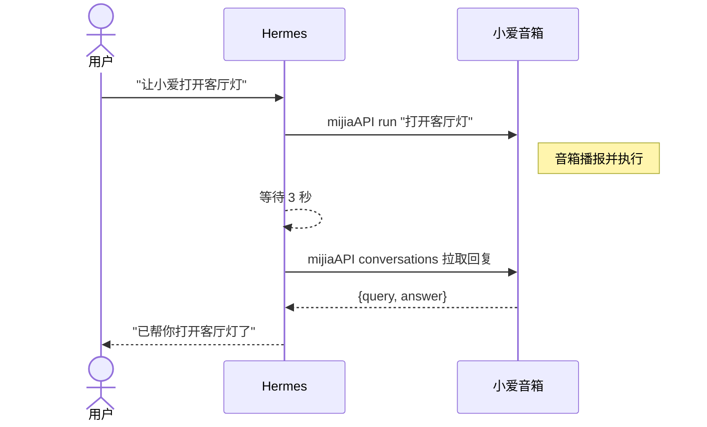
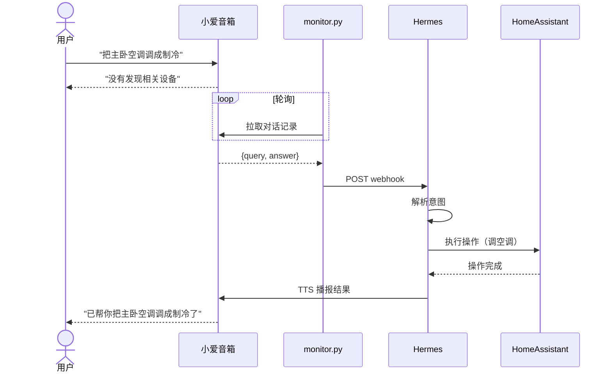

# hermes-xiaoai-bridge

> Hermes Agent ↔ 小爱音箱 双向语音桥梁。把小爱音箱变成 Home Assistant 语音入口。

底层依赖 [mijiaAPI](https://github.com/yosefzhang/mijia-api)（小米 MIoT / MINA API 封装库）。

## 场景一：Hermes → 小爱（转发模式）

用户通过微信/飞书等渠道让 Hermes 操控小爱音箱。

## 场景二：小爱 → Hermes（监听模式）

用户直接对小爱说话，小爱无法处理时转交 Hermes 接管。

